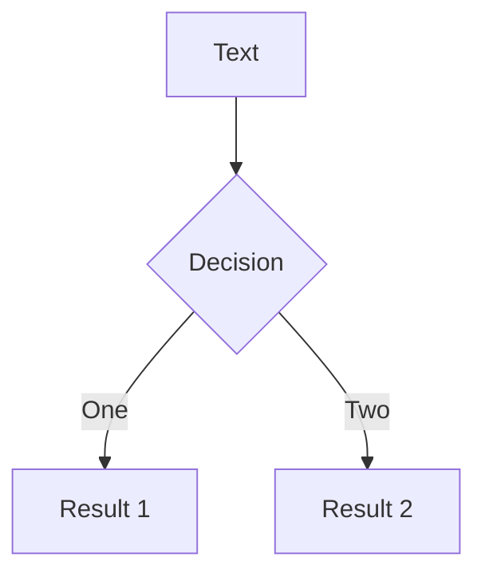

# [Mermaid Diagrams](https://sli.dev/features/mermaid.html)

#Diagram 

````md

```mermaid {theme: 'neutral', scale: 0.8}
graph TD
B[Text] --> C{Decision}
C -->|One| D[Result 1]
C -->|Two| E[Result 2]
```
````